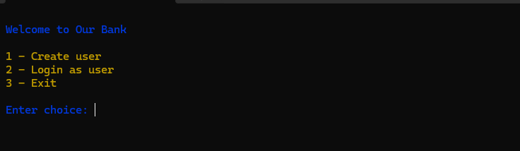
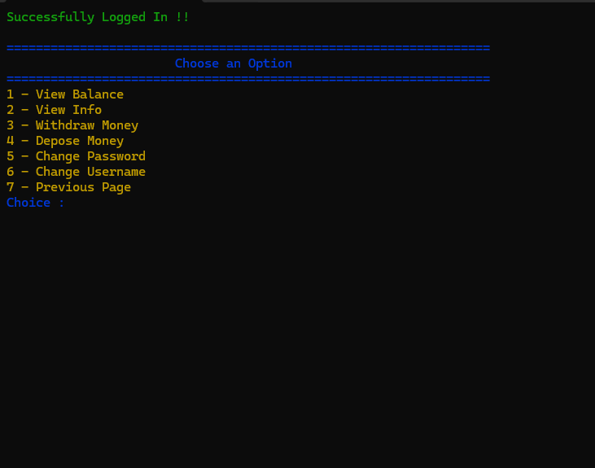
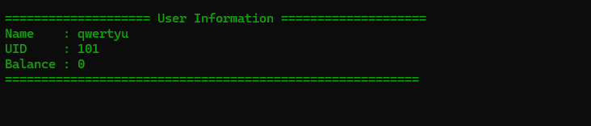

# 🏦 Bank Management System

A console-based Bank Management System built in C++ using object-oriented principles, custom data structures (like doubly linked lists and hashing), and modular design. It helps manage user accounts, transactions, and basic banking operations.

---

## 🛠️ Features

- Create and manage user bank accounts.
- Deposit and withdraw money.
- Search and display accounts.
- Use of custom-built:
  - 🔁 **Doubly Linked Lists** for storing accounts.
  - 🧠 **Hash Tables** for fast lookups.
- Fully modular and clean code.
- Terminal color support with `termcolor`.

---

## 📸 Screenshots

### Login Page

### Logged in as a user

### View Info

## 📚 Learning Highlights

Practiced C++ OOP design patterns.

Implemented data structures from scratch.

Learned to organize code with headers and templates.

Used CMake for modern cross-platform builds.

## 🤝 Credits

Made with 💻 by Mohamed Fouad Rashid
Special thanks to Ihor Kalnytskyi for terminal color formatting.

Visit his profile : https://github.com/ikalnytskyi
